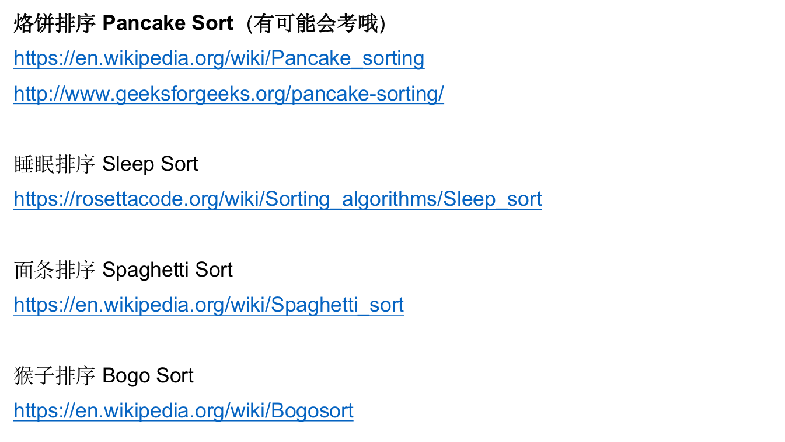
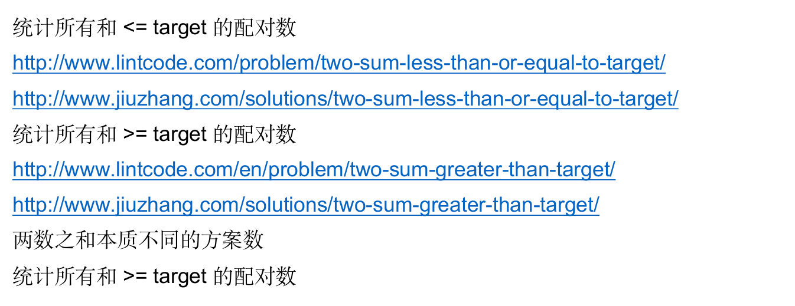

# Two Pointers

---

## To-Be Finished

---

### K-Sum

1. Total number of solutions: Dynamic Programming
2. All possible solutions: Depth-First State-Space Search

---

### Other Sorting Algorithms

---

### Two Sum

